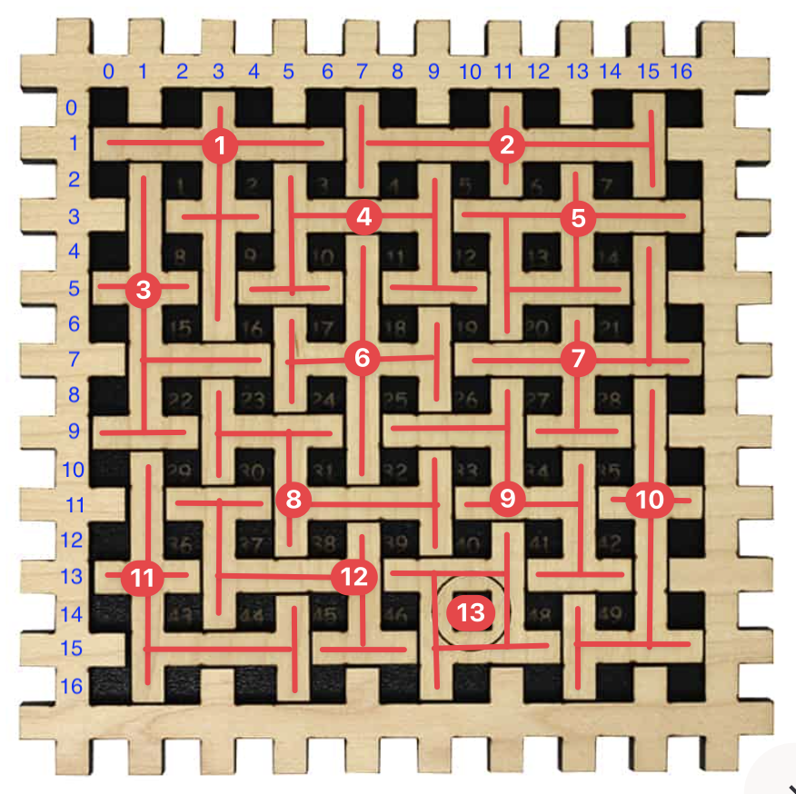
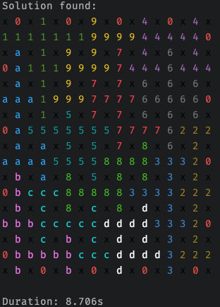

# 1-49-puzzle-solver

Solver for the puzzle https://cruxpuzzles.co.uk/products/1-49-new



In code, the pieces are represent using hex (so 10 is `a`, 11 is `b` etc).

The `0` piece is the "teeth" of the board edge.

It is assumed that the pieces can be rotated and flipped.

Note currently this returns the first solution, instead of all solutions (as finding all solutions can take a lot
longer).

# Installation

## MacOS
You can install the solver from homebrew tap:

```bash
brew install ryan-ju/homebrew/one_forty_nine_solver
```

and run it:

```bash
one_forty_nine_solver -t 46
```

## Linux & Windows

Download from https://github.com/ryan-ju/1-49-puzzle-solver/releases

# How to run

```bash
# Solve for 46
RUSTFLAGS=-Awarnings cargo run --bin solver -- -t 46
```

This prints the solution (if found) like below:



Your terminal needs to support true color to show the colors. To check, run `echo $COLORTERM` and see if output is
`truecolor`.

# Brief explanation of the algorithm

The core is [depth first search](https://en.wikipedia.org/wiki/Depth-first_search).

Each child node is created by placing an unused piece on the board.

To limit the search space, it keeps track of the next free coordinate, and aligns the current piece's top-left corner
with that coordinate, then computes whether the piece can be placed.

# Improvements

* I implemented a faster overlap check function.  
  * Command: `RUSTFLAGS=-Awarnings cargo run --bin solver -F fast -- -t 46`
* To run faster, enable the `release` profile.  This improves the performance a lot.
  * Command: `RUSTFLAGS=-Awarnings cargo run --profile release --bin solver -F fast -- -t 46`

# Development

* Linting

```bash
cargo fmt
cargo clippy
```

* Testing

```bash
cargo test
```

* Build

```bash
cargo build
```

and for cross platforms:

```bash
# Need goreleaser >= v2.7.0
goreleaser release --snapshot --clean
```

* Publish to homebrew tap

```bash
# Must tag it first
git tag v0.0.12
goreleaser release
```
